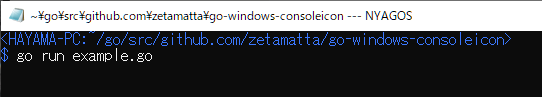

go-windows-consoleicon
======================

Set icon to the corner of the current console (Command Prompt)

```go
// +build example

package main

import (
    "os"

    "github.com/zetamatta/go-windows-consoleicon"
)

const icon_restore = true

func main() {
    closer, err := consoleicon.SetFrom(`C:\Windows\System32\notepad.exe`)
    if err != nil {
        return
    }
    defer closer(icon_restore)

    var dummy [1]byte
    os.Stdin.Read(dummy[:])
}
```


